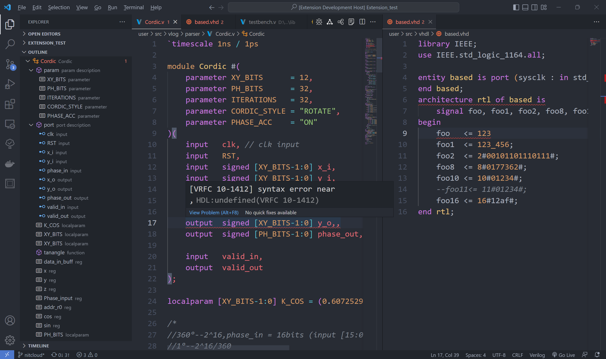

#! https://zhuanlan.zhihu.com/p/365805011
# Digital IDE 开发手册-version 0.2.7

## 前言

- 安装地址[插件市场](https://marketplace.visualstudio.com/items?itemName=sterben.fpga-support)
- 如有问题的话欢迎在[issues](https://github.com/Bestduan/Digital-IDE/issues)上发表。
- 喜欢的话请给个[star](https://github.com/Bestduan/Digital-IDE)吧。

- 邮箱： sterben.nitcloud@gmail.com 
- QQ群： 932987873

在使用过程中遇到问题的可以进QQ群与我联系，在群里我看到即回复。

## 关于反馈

首先感谢您的使用与反馈，首先如果您有关于此插件更好的想法在知乎和github下均可发表，但如果是使用中出现的问题请移步至[github](https://github.com/Bestduan/Digital-IDE/issues)发表，请勿在知乎下发表，感谢您的配合。

此外在发表issue的时候，请详细说明您所遇到的问题，重点包含以下部分
- 运行环境
- 使用版本
- 报错信息 (来源：vscode本身以及Toggle Developer Tool)
- 具体问题，以及出现的原因
- 如果是特殊情况请粘贴源码 (为了更好的能复现问题)
- 请尽量截图展示

## TODO LIST


# 快速开始
* Start interface
注：本插件是下载即用，无需做任何环境，除非需要其他三方工具（如：vivado、iverilog等）时，要自行安装软件。


## 工程配置
本插件定义工程配置文件为`property.json`，只放置于`.vscode`文件夹下

### 工程配置文件的生成
使用 *TOOL:generate property file* 可以生成初始的 `property.json` 模板文件。生成的配置文件会直接放置于.vscode的文件夹下
如果你有属于自己的模板可以使用*TOOL:Overwrite the InitPropertyParam* 来自定义模板文件。

### 工程配置文件的说明
注：在0.2.7版本之后将使用全新的配置属性
```json
// porperty.json 所有属性解说
{
    // 当前使用的第三方工具链
    "TOOL_CHAIN": "xilinx", 

    // 工程命名 
    // PL : 编程逻辑设计部分即之前的FPGA
    // PL : 处理系统设计部分即之前的SOC
    "PRJ_NAME": {
        "PL": "template",
        "PS": "template"
    },

    // 自定义工程结构，若无该属性则认为是标准文件结构（详见下文说明）
    // 工程路径，软硬件设计路径
    // 所有属性均支持${workspace}、${plname}、${psname}、相对路径的写法
    // ${workspace} ： 当前工作区的路径
    // ${plname}、${psname} ：PL或PS的工程的名字
    "ARCH" : {
        "PRJ_Path": "",
        "Hardware" : {
            "src"  : "${workspace}/hardware/${plname}.src",  // 放置设计源文件，注: src上一级为IP&bd
            "sim"  : "${workspace}/hardware/${plname}.sim",  // 放置仿真文件，会直接反应在树状结构上
            "data" : "${workspace}/hardware/${plname}.dat"   // 放置约束、数据文件，约束会自动添加进vivado工程
        },
        "Software" : {
            "src"  : "${workspace}/software/${psname}.src",  // = D:/workspace/template.src
            "data" : "${workspace}/software/${psname}.dat"
        }
    },

    // 代码库管理，支持远程和本地两种调用方式（详见下文库管理）
    // 使用UI来进行配置，不建议用户直接更改
    "library" : {
        "state": "", // local | remote
        "Hardware" : {
            "common": [], // 插件提供的常见库
            "custom": []  // 用户自己的设计库
        }
    },

    // xilinx的IP仓库，直接添加到vivado的IP repo中
    // 目前支持ADI和ARM提供的IP repo （adi | arm）
    "IP_REPO" : [],

    // 当设计时用到PL+PS即为SOC开发
    // 当其中core不为none的时候即为混合开发
    "SOC": {
        "core": "none",
        "bd": "",
        "os": "",
        "app": ""
    },

    // 工程综合实现时，是否在终端输出信息
    "enableShowlog": false,

    // 设备类型
    "Device": "none"
}
```

其中最重要的属性是`ARCH`属性，配置了`ARCH`属性则认为是用户自定义工程结构。对于用户自定义结构，一切文件变动均由用户自行管理。当不进行`ARCH`属性配置的时候则认为使用本插件推荐的标准文件结构。对于标准文件结构的说明如下：
```
.vscode
  └── property.json   -- 工程配置文件 用户自定义 (或者存放于工作区的根目录也可)
prj                   -- 用于存放工程文件
  ├── simulation      -- 用于存放第三方仿真工具运行时的中间文件
  ├── intel           -- 用于存放Intel的工程文件
  └── xilinx          -- 用于存放xilinx的工程文件
user                  -- 用于存放用户设计的源文件 用户自定义
  ├── ip              -- 用于存放工程ip代码 (厂商工具管理，但由插件搬移至src同级目录)
  ├── bd              -- 用于存放工程block designer源码 (厂商工具管理，但由插件搬移至src同级目录)
  ├── data            -- 主要存放数据文件，以及约束文件
  ├── sim             -- 用于存放用户仿真代码
  └── src             -- 用于存放用户的设计源码   
       └─ lib         -- 用于存放用户的硬件库源码   
```

当 `property.json` 文件中 `SOC.core` 设置不为 "none" 后保存配置文件时，文件结构会自动更改为PS+PL的混合设计结构。在该结构下user文件夹会发生改变，变为如下结构：
```
user               -- 用于存放用户设计的源文件 用户自定义
  Hardware         -- 主要存放硬件逻辑设计
     ├── ip        -- 用于存放工程ip代码 (厂商工具管理，但由插件搬移至src同级目录)
     ├── bd        -- 用于存放工程block designer源码 (厂商工具管理，但由插件搬移至src同级目录) 
     ├── data      -- 主要存放数据文件，以及约束文件
     ├── sim       -- 用于存放用户仿真代码
     └── src       -- 用于存放用户的设计源码  
          └─ lib   -- 用于存放用户的硬件库源码   
  Software         -- 主要存放软件驱动设计
     ├── data      -- 主要存放数据文件，以及约束文件
     └── src       -- 用于存放用户的工程源码   
```
注：在`SOC.core`的值由非none变为none时，Software文件夹默认为不需要，会被删除（插件也会给出相应的提示），请做好备份。另外，*IP和bd设计会被放置到src的上一级目录，因此src最好不要设置为工作区的根路径*。

此外，如果用户在ARCH下配置的路径错误或者无效，插件会直接改为标准下的结构路径。*当用户不去配置`property.json`文件时，文件结构全部默认为工作区的路径，该行为可能会造成大量的性能消耗，请用户注意*。

# 功能介绍

## 语言服务
提供前端代码设计所需的基本语言服务

### 语言高亮

现支持以下语言的高亮
1. HDL
   - verilog & systemverilog
   - VHDL
2. TCL 
   - xdc
   - sdc
   - fdc (包括xdc、sdc、fdc约束文件)

### 语法诊断

在该插件0.2.0版本之后将支持自带的语法诊断器，支持的语法有：
- vhdl
- verilog
使用自带的语法诊断器需要将 `HDL.linting.{vlog/vhdl}.linter` 设置为 `default`。
【注】：虽然有自带的语法检查器，但插件的默认设置依旧为`vivado`，一方面因为该插件主要支持对vivado的联合开发，另一方面vivado支持全HDL语法的检查，而default暂不支持对systemverilog语法的检查，并且检查并不准确。

但语法检查器是可以灵活选择的，使用者可以根据自己已有的环境进行搭配出适合自己的组合。
- 针对 verilog 以及 systemverilog 
    *HDL.linting.vlog.linter* 支持的有:
    1. vivado   
    2. modelsim
    3. iverilog     
    4. verilator
    5. verible    
    6. default(暂不支持sv)
- 针对 vhdl
    *HDL.linting.vhdl.linter* 支持的有: 
    1. vivado系列     
    2. modelsim系列   
    3. ghdl 
    4. default

### 文件标识

文件标识为大纲（outline）显示的内容，能快速preview整个工程。
关于支持的定义类型会持续更新。

### 悬停提示

主要提示的内容为当前文件内定义的数据类型以及例化模块的相关信息。
提示内容如下：
1. `标识对应的注释` + `标识对应的内容`
2. 二进制、十六进制 -> 十进制

其中标识对应的注释的内容为
1. 标识被定义的所在行后的行注释
2. 标识被定义之前的行注释以及块注释(遇到非注释部分即停止)

`【注】`：悬停提示使用的是内置的vlog和vhdl解析器，目前暂时只支持简单的悬停提示

### 自动补全

该插件所提供的自动补全分两部分：
1. snippet文件提供的自动补全，支持用户添加
2. 关键符触发自动补全
   1. `.`关键符触发例化模块的端口或者参数名的补全
   2. `\`关键符触发宏定义标识的补全
   3. `/`关键符触发include中路径的补全
`【注】`：目前自动补全只支持在verilog和systemverilog中例化模块里进行端口参数例化时的补全

### 定义跳转

如果悬停提示支持有效那就能支持定义的跳转。
但有些时候无法完成定义的跳转，其原因是解释器没有正确的解释出代码，这时候可以将`linter`设置为`default`，使用解释器进行检查查看代码语法的正确性。

### 自动格式化

可以对选中的字符或者全文进行文档的格式化 vscode自带快捷键打开方式：`shift + alt + f`
相关设置(setting)说明:
- verilog and systemverilog
1. *HDL.formatter.vlog.default.style*
    - verilog 和 systemverilog格式化类型，支持三种类型 `kr`、`ansi`、`gun`
2. *HDL.formatter.vlog.default.args*
    其他参数输入，vlog的格式化使用的是istyle的webassembly因此要输入的参数请参考istyle
    `【注】`：由于该功能是基于istyle来实现的因此对全文格式化依旧不是很完善，建议选中always语句块来进行格式化，后期会持续修复相关问题。

- vhdl
1. *HDL.formatter.vhdl.default.align-comments*
    - 是否需要对齐注释
2. *HDL.formatter.vhdl.default.indentation*
    - tab所对应的空格数量

### vhdl转Verilog翻译

目前只支持vhdl转Verilog的翻译功能。
如果没有输出的话，则意味着vhdl的语法错误，或者有插件无法解析的语法。

## 工程管理
工程管理主要需要实现以下几个业务
1. 工程搭建类
   1. project Manager (PS & PL)
   2. lib Manager (IP & bd)
2. 仿真搭建类
   1. generate instance & tb file
   2. fast simulate
3. 设计辅助类
   1. [x]tree Structure
   2. [x]netlist preview
   3. [x]Code to doc
   4. [x]fsm preview
   5. []fsm designer
   6. []waveform preview

### 工程搭建
工程搭建的目的是帮助用户快速搭建属于自己第三方工程的，尤其是`project Manager`和第三方工具链相关，目前兼容的第三方工具只有xilinx的vivado（后续会继续支持其他三方）。而`lib Manager`则是为了避免重复造轮子而提供的一个功能，方便用户使用插件提供的一些常见HDL library，也支持用户自己积累library。

#### project Manager
`project Manager`的主要目的如下：
1. 抽象出功能，减少其他三方工具的学习成本
2. 抹除版本差异，使得更加专注源码的设计
   - 因为只要有配置文件和设计源就能在任意一个vivado版本下还原工程 

注：`project Manager`是强依赖属性配置文件`property.json`的，如果省缺会直接使用默认(模板)配置

对于PL端的工程管理，我抽象出以下几个功能：
1. launch ------ 启动整个工程，如果没有工程则创建，有的话则直接打开
2. refresh ----- 刷新整个工程，更新整个工程的设计
3. simulate ---- 仿真整个工程，默认不打开GUI界面 *`（使用的是TOOL_CHAIN里的仿真器）`*
   1. simGUI ----- 仿真成功后打开GUI界面
   2. simCLI ----- 仿真成功后不打开GUI界面
4. build ------- 构建整个工程，并最后输出bit流文件
   1. synth ------ 进行工程的综合
   2. impl ------- 进行工程的实现
   3. bit -------- 输出工程的bit流文件
5. program ----- 比特流文件下载到FPGA/zynq板子中去 *`（下载烧写，但不固化）`*
6. gui --------- 打开工具链的GUI界面
    1. 打开GUI后，名为 *`HardWare`* 的终端不建议自行关闭
       - 直接关闭后整个GUI界面会自动关闭，若不保存则可能会导致设计丢失。
       - 直接关闭后插件不会将你的`IP和bd设计`移动`Hardware.src`的同级目录下
7. exit -------- 关闭工程，仅在CLI下有效，在打开GUI之后，终端控制权被GUI接管。
    1. 在点击`exit`之后插件会将你的`IP和bd设计`移动`Hardware.src`的同级目录下
    2. 如果直接关闭名为 *`HardWare`* 的终端则不会进行`IP和bd设计`的移动。
    3. 注：功能栏 *TOOL* 中的 *Clean* 时也可以将你的`IP和bd设计`移动`Hardware.src`的同级目录下

除了以上几个显性功能外，还有两个隐性功能分别在`architecture`栏中，分别为
1. `Set as Top` -------------- 将该文件设置为当前工程的设计顶层模块
2. `Set as Testbench Top` ---- 将该文件设置为当前工程的仿真顶层模块

特殊地，*`Zynq`*器件支持PS+PL混合开发，为了应对混合开发的情况，插件给出`SOC`配置如下：
```json
"SOC": {
    "core": "ps7_cortexa9_0",
    "bd"  : "zynq_default"
}
```
使用如上配置插件会自动构建一个包含zynq设计的bd工程，帮助用户快速搭建平台。

最后关于设备选型，在`property.json`文件中的*Device*属性下配置即可。
目前已有的如下：
- xc7z020clg400-2
- xc7a35tftg256-1
- xc7a35tcsg324-1
- xc7z035ffg676-2
- xc7z020clg484-1

但支持的器件并不仅限于此，理论上可以支持vivado所能支持的所有器件，你可以直接将你的器件直接写在*Device*属性中，此时由于数据库中没有该设备会报警告，但不妨碍运行。如果要消除警告需要将你的器件通过*FPGA:Add devices to the database*命令将其添加到数据库中。对于不需要的设备也可以通过 *FPGA:Remove the device from the database* 将其从数据库中删除。

**相关设置**
`TOOL.vivado.install.path` --- vivado的安装路径
当安装好vivado之后，可以直接在插件内部直接配置vivado的安装路径，也可以将vivado添加到环境变量中去（推荐）。如果路径错误找不到则默认为已经添加到环境变量中去了。
*e.g. : D:/APP/vivado_18_3/Vivado/2018.3/bin/*
注意：在路径中使用斜杠`/`分隔，并且配置到bin目录下。

`PRJ.xilinx.IP.repo.path` ---- 用户自行设计的xilinx的IP仓库
配置该属性后插件会自动将该路径添加到vivado的IP repo中去
*e.g. : D:/project/FPGA/.Lib/xIP*

#### lib Manager
该插件自带HDL功能库链接功能。
`property.json`文件中配置如下：
```json
"library" : {
    "state": "", // local | remote(default)
    "Hardware" : {
        "common": [],
        "custom": []
    }
},

"IP_REPO": [
    "arm", // 包含ip CM3DbgAXI & DAPLink_to_Arty_shield
    "adi"  // 包含 adi 公司下所有器件ip，已去除所包含的绝对路径 取自 adi2019_r1
],
```

对于`property.json`文件中的library属性不建议用户自己配置，建议使用*import library*命令，或者下图中的图标激活命令进行配置。

*state* 属性代表是库文件是加载到本地工作区，还是作为远程进行链接。
- `remote` 代表从远程虚拟包含（不在工作区下的都被认为远程，而不是网络上的远程）。
  - 远程库文件可以打开并更改 *(`注：`如果更改之后下次导入就是更改之后的代码)* 。
- `local`  代表将远程文件导入到该工程本地
  1. 放置到`ARCH.Hardware.src`下的lib中，此时更改不会影响远程库中的代码。
  2. *`注：`当从local改回remote时lib文件夹会被删除（插件会提醒），请注意*。

*common* 属性代表插件自带的HDL功能库，*该库的代码不太成熟，仅供参考*。
目前已经经过仿真测试的lib路径如下
- Soc
- Math/Cordic.v
- Math/Sort3.v
- Math/Sqrt.v
- Malloc/RAM/Shift_RAM
- Apply/DSP/Advance/Communicate/Modulate
- Apply/DSP/Base/DDS
- Apply/Image  (需要包含 Sort3, Sqrt, Shift_RAM)

`【注】`：当输入的是文件夹时则包含该文件夹下所有的文件。此外不建议直接更改该库中的代码，更改之后再在下一次插件更新之后会被重新覆盖，请慎重。

*custom* 属性代表用户自定义HDL功能库。
该属性的使用需要对*setting*下的*PRJ.customer.Lib.repo.path*进行配置用户自定义库的根目录，并与*custom*属性下的配置组成文件(夹)的绝对路径。表示如下：
*`PRJ.customer.Lib.repo.path`*`/`*`${custom}`* 

`【注】`：当输入的是文件夹时则包含该文件夹下所有的文件。

最后，对于`IP_REPO`属性，这是插件向用户提供的两个官方xilinx IP repo，选择自己想要的进行配置，插件会自动添加到vivado的IP repo中去，方便用户直接开发，不用自己去编译导入。

### 仿真搭建
仿真搭建的目的是帮助用户能快速搭建起自己的仿真框架，并快速的获得仿真结果。

#### generate instance & tb file


该插件支持不同语言间的交叉例化，比如在verilog文件中例化verilog和vhdl模块，或者在vhdl文件中例化Verilog和vhdl模块。

步骤如下:
1. 将光标放置在文本需要例化处。
2. 使用快捷键`F1`启动命令框，输入*Instance*，选择`TOOL:Instance`。
   1. 或者使用快捷键`Alt + I`。
   2. 或者在需要例化处右击选择`Instance`
3. 输入需要例化的模块的关键字（插件会自动匹配）。
4. 选择需要例化的模块。

`【注】`：在使用快捷键时，需检查是否存在快捷键键冲突。

除了自动例化外，插件还提供了一个verilog的仿真模板，使用方式如下：
1. `F1`启动命令框，输入*Testbench*, 选择`TOOL:Testbench`
   1. 或者在需要生成并例化的文件下右击选择`Testbench`。
2. 选择仿真文件的类型以及需要存储的位置，如果存在直接替换即可。

如果想要更改testbench模板的话步骤如下：
使用快捷键`F1`启动命令框，选择TOOL:Overwrite the template of testbench，选择要更改的仿真文件的类型，这时会打开testbench file的初始化文件在此基础上更改保存即可。此外请保留 `//Instance` 标志，该标志是用于识别需要例化的位置。

后期会考虑tb文件与例化模块间的智能连线。

#### fast simulate
该功能的目的是为了能快速地对单个模块，或几个模块组成的小工程进行快速地仿真。
目前支持的仿真工具只有iverilog，后续会持续更新，添加新的支持。

**iverilog快速仿真**

在0.1.18版本之后优化设计支持 `include` 设计
特色如下：
1. 自带多文件仿真，无需 *`include*   
2. 支持xilinx仿真库
    - 在setting中的 *SIM.Xilinx.LIB.path* 设置xilinx的安装路径
    - 例：{xilinx安装路径}/Vivado/<版本号，例如18.3>/data/verilog/src

**相关设置**
`TOOL.iverilog.install.path` --- iverilog的安装路径
当安装好iverilog之后，可以直接在插件内部直接配置iverilog的安装路径，也可以将iverilog添加到环境变量中去（推荐）。如果路径错误找不到则默认为已经添加到环境变量中去了。
*e.g. : D:/APP/iverilog/bin*

`TOOL.gtkwave.install.path` --- gtkwave的安装路径
当安装好gtkwave之后，可以直接在插件内部直接配置gtkwave的安装路径，也可以将gtkwave添加到环境变量中去（推荐）。如果路径错误找不到则默认为已经添加到环境变量中去了。
*e.g. : D:/APP/iverilog/gtkwave/bin*

`TOOL.simulate.runPath` --- 快速仿真中产生的中间文件放置路径
默认为：*${ARCH.PRJ_Path}/simulation*
如果路径不存在或则错误则依旧是默认路径。

`SIM.Xilinx.LIB.path` --- xilinx的IP仿真库放置路径
*e.g. {xilinx安装路径}/Vivado/<版本号，例如18.3>/data/verilog/src*

### 设计辅助

#### tree Structure

工程结构，以层级关系显示出HDL文件之间包含与被包含关系，单击后可打开对应的文件。

#### netlist preview

插件使用了`yosys 0.21`版本的内核(开源的yosysjs为0.5版本)进行指定工程的综合(可全平台运行)，并展示综合后的网络图，支持 `include` 以及多文件工程。

使用方式
1. 点击右上角的图标进行面板的创建
2. 或者在project structure中选择需要显示的模块，或者在文件中右击选择 `show netlist`

#### Code to doc


#### fsm preview


# 鸣谢

* [VHDL](https://github.com/puorc/awesome-vhdl)
* [yosys](http://www.clifford.at/yosys)
* [TerosHDL](https://github.com/TerosTechnology/vscode-terosHDL)
* [TCL Language Support](https://github.com/go2sh/tcl-language-support)
* [Verilog HDL/SystemVerilog](https://github.com/mshr-h/vscode-verilog-hdl-support)
* [SystemVerilog - Language Support](https://github.com/eirikpre/VSCode-SystemVerilog)